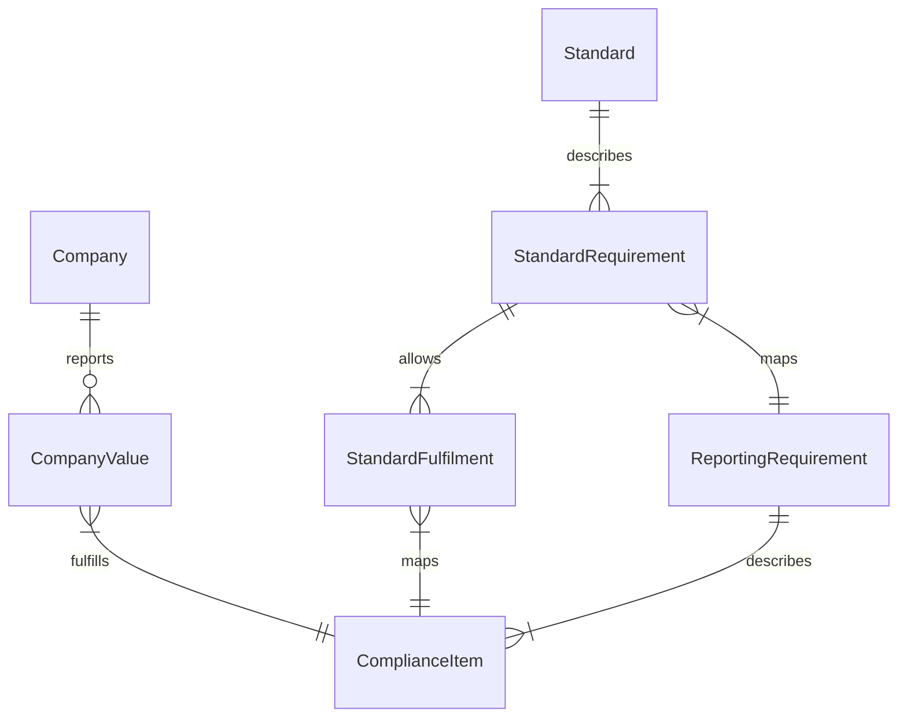

1) Datenbank aufsetzen
	1) Schema dokumentieren
	2) Datenimport aus Google Sheet
2) Retool für Eingabemaske
3) Auswertungen:
	- Vorberechnung?
	- Backend
	- Frontend
4) Eingabemaske
5) Blog, Landingpage etc

### Referenz / Konzept
- Konzept in [Figma](https://www.figma.com/file/7jJq6KePXijWk5JNdPjny6/SRN!?node-id=0%3A1)
- Jupyter Notebook
- Streamlit App

### Infra
- Backend -> Cloud Run
	- Python
- Frontend -> Firebase
	- React
	- [Tailwind](https://tailwindcss.com/) vs [Bootstrap](https://getbootstrap.com/)
- Database (Postgres) -> [Google Cloud SQL](https://console.cloud.google.com/sql/instances/srn-prod/users?project=srn-prod)
- Temporary Backend -> [Retool](https://srnavigator.retool.com/)
- Temporary Frontend -> Streamlit
- Temporary Database -> Google Sheet
- CMS -> Contentful Community Edition

### Github repos
- Orga erstellen -> sustainabilityreportingnavigator
- Reference
	- Streamlit
	- Jupyter
	- ...
- Backend
- Frontend

## Dokumentation?
- Von oben nach unten lesen
- Kardinalität
	- `||`  bedeutet "genau eins"
	- `|}` bedeutet "eins oder mehrere"
	- z.B. Standard describes one or more StandardRequirement

