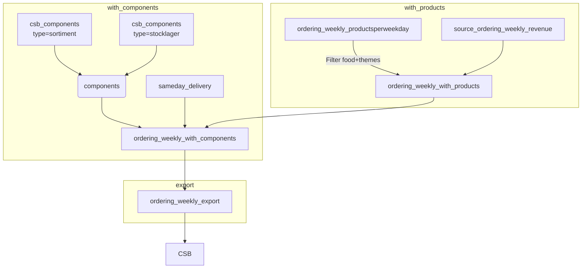

[[Mermaid]]

```mermaid
graph TD;
	subgraph C[with_products]
		ordering_weekly_productsperweekday-- Filter food+themes -->with_products
		source_ordering_weekly_revenue-->with_products
		with_products[ordering_weekly_with_products]
	end
	subgraph B[with_components]
		csb_sortiment[csb_components<br />type=sortiment]-->components
		csb_stocklager[csb_components<br />type=stocklager]-->components
		components(components)-->with_components
		with_products-->with_components
		sameday_delivery-->with_components
		with_components[ordering_weekly_with_components]
	end
	subgraph A[export]
		export[ordering_weekly_export]
	end
	
	export-->CSB
	with_components-->export
```
