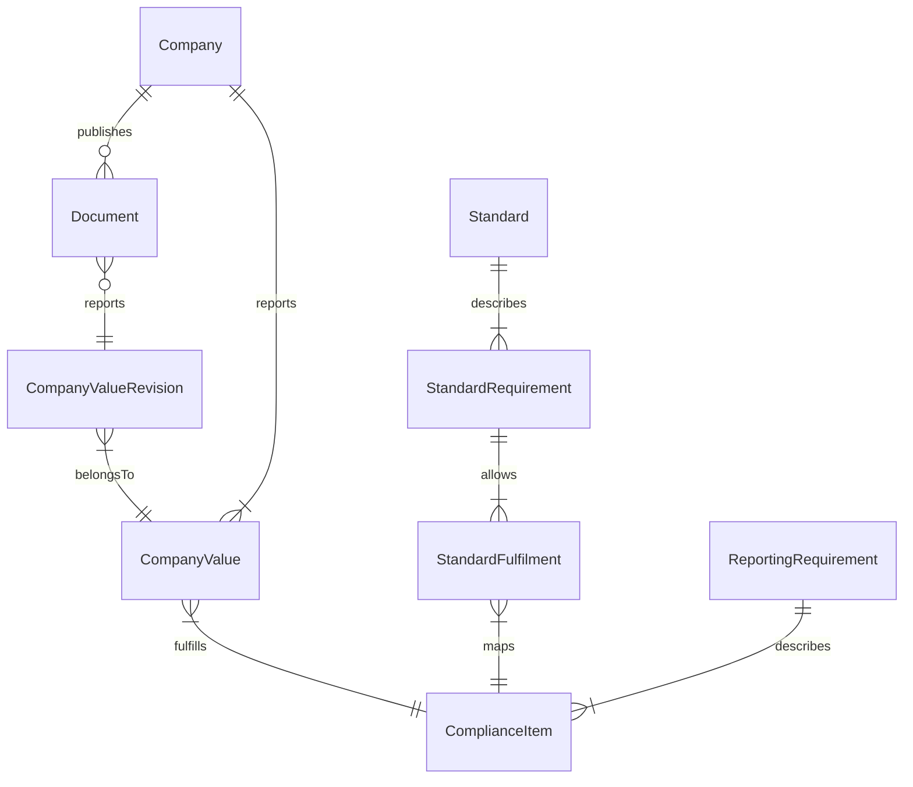

jour fix
send new invoice

New endpoint:
- Edit value revisions
	- Set all relevant fields
	- Permissions: Editor
- Set verified revision
	- Permissions: Admin
- Who sees what during editing?
	- Only verified values are displayed, or own revision

Phase 2:
- Disable direct value editing
- Remove document_id from CompanyValue
- Remove document_ref from CompanyValue
- Migrate all document_id to company_id

Questions:
- What's Materiality?

