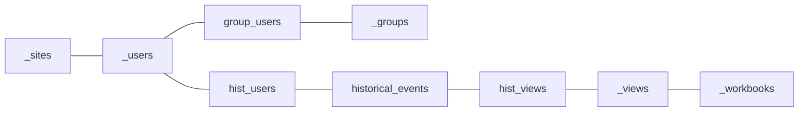

> Rudi from sell & pick introduces their company’s strategy for dashboard housekeeping and strengthening user engagement by analyzing Tableau Server Logs.

---

Agenda:
- Who is sell & pick?
- Backup your server to an external repository
- Schema
- Dashboard

---

## About sell & pick
- Focus: Improve data-driven processes for restaurants and bakeries
- Use Cases:
	- Controlling & Operations - Tableau!
		- (Pulling data from a variety of sources)
		- (Combining and harmonizing data points across varying systems)
		- (Provide interactive dashboards)
	- Ordering & Personnel management - Process Automation
		- (AI driven forecasts)
		- (Process automation -> Writing back to source systems
- Team: 4 Data professionals + 2 food service consultants
	- "data team as a service"

Feedback:
- Bullets raus, erzählen

---

## Introduction
- Going beyond Tableau built-in dashboards
	- ("Traffic to Views")
	- ("Actions by All Users")
	- (Nice intro, just gets you thinking about what's next)
	- (Contra to the philosophy, dig in further!)
- Liberate your data from Tableau Repository -> *Tagline?*
- How sell & pick thinks about "healthy usage"

---

## Backup your repository to an external database
```
# Find path to pg_bin
export pg_bin=/opt/tableau/tableau_server/packages/pgsql.xxxxx.xx.xxxx.xxxx/bin

# Hack to allow us to log in with the superuser without a password. Set "tblwgadmin" from "md5" to "trust"
vi /var/opt/tableau/tableau_server/data/tabsvc/config/pgsql_0.xxxxx.xx.xxxx.xxxx/pg_hba.conf
host    all         tblwgadmin     127.0.0.1/32          md5
->
host    all         tblwgadmin     127.0.0.1/32          trust

# Reload server to pick up the changed config
su tableau
PGDATA=/var/opt/tableau/tableau_server/data/tabsvc/pgsql/data/ /opt/tableau/tableau_server/packages/pgsql.xxxxx.xx.xxxx.xxxx/bin/pg_ctl reload
exit

# Create backup - Password no longer necessary!
$pg_bin/pg_dump -d workgroup -h 127.0.0.1 -U tblwgadmin -p 8060 -f backup.sql -F p --no-acl --no-owner

# Take the backup.sql file and load it into your database!
```

---

## Schema

TBD: Primary Keys?
Why historical_events? -> Full history!
hist_xxxx includes deleted views/users/etc

More info:
https://tableau.github.io/tableau-data-dictionary/2023.1/data_dictionary.htm

---

## Usage dashboard

![[Screenshot 2023-04-14 at 16.01.53.png]]

- Context: Presented biweekly by our CSM team to client's management team
- Show overall license usage
- Show usage week by week to monitor for trends
- "Engagement"; Frequency of using dashboards, not just intensity
- Define individual actions for groups or users
	- Set expectations for each user group
	- Restaurants vs management team
	- Monitor progress directly in dashboard
- Formula definition:
	- Ensure usage every day (how many actions per day is not relevant to our case)
	- Therefore maximum score is "7" for daily use

---

## Housekeeping
- Ensure Dashboards are used for their intended purpose
- Remove unused "specialized" dashboards
- Encourage users with joint training

---

## Next steps
- Data lineage
	- column_assets
	- xxx_assets
- Export to your lineage tool of choice (Google Dataplex -> BigQuery Lineage)