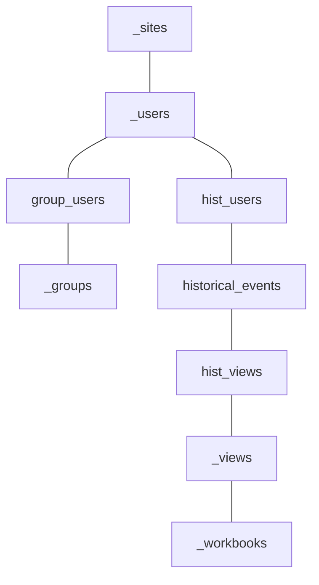

> Rudi from sell & pick introduces their company’s strategy for dashboard housekeeping and strengthening user engagement by analyzing Tableau Server Logs.

Agenda:
- Who is sell & pick?
- Backup your server to an external repository
- Schema
- Dashboard

---

## Who is sell & pick?
- Restaurants!

---

## Backup your repository to an external database
```
# Find path to pg_bin
export pg_bin=/opt/tableau/tableau_server/packages/pgsql.xxxxx.xx.xxxx.xxxx/bin

# Hack to allow us to log in with the superuser without a password. Set "tblwgadmin" from "md5" to "trust"
vi /var/opt/tableau/tableau_server/data/tabsvc/config/pgsql_0.xxxxx.xx.xxxx.xxxx/pg_hba.conf
host    all         tblwgadmin     127.0.0.1/32          md5
->
host    all         tblwgadmin     127.0.0.1/32          trust

# Reload server to pick up the changed config
su tableau
PGDATA=/var/opt/tableau/tableau_server/data/tabsvc/pgsql/data/ /opt/tableau/tableau_server/packages/pgsql.xxxxx.xx.xxxx.xxxx/bin/pg_ctl reload
exit

# Create backup
$pg_bin/pg_dump -d workgroup -h 127.0.0.1 -U tblwgadmin -p 8060 -f backup.sql -F p --no-acl --no-owner

# Take the backup.sql file and load it into your database!
```

---

## Schema
![[Screenshot 2023-04-14 at 15.47.56.png]]


---

## Usage dashboard

![[Screenshot 2023-04-14 at 16.01.53.png]]

- Context: Presented biweekly by our CSM team to client's management team
- Show overall license usage
- Show usage week by week to monitor for trends
- Define individual actions for groups or users
	- Set expectations for each user group
	- restaurants vs management team
	- Monitor progress directly in dashboard

---

## Housekeeping
- Ensure Dashboards are used for their intended purpose
- Remove unused "specialized" dashboards
- Encourage users with joint training
- 